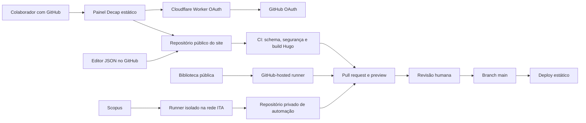

# Plano de implementação — Decap CMS e automações de dados do site IEA

**Data do plano:** 14 de agosto de 2026
**Repositório avaliado:** `flavioluiz/iea_site_dev`
**Escopo:** planejamento; este documento não implementa nem ativa serviços.

## 1. Resultado pretendido

O site deve continuar sendo um site estático Hugo, mas com três caminhos de atualização:

1. **Edição simples:** uma pessoa entra no Decap CMS com sua conta GitHub, altera uma página, um professor, uma foto, um laboratório ou um projeto e envia a mudança para revisão.
2. **Edição em massa:** uma pessoa edita diretamente um arquivo JSON canônico, inclusive colando uma lista produzida com auxílio de IA. A mudança só pode ser incorporada depois de validação automática e revisão humana.
3. **Atualizações automáticas:** Scopus e Biblioteca Digital do ITA geram pull requests periódicos com as diferenças encontradas. Nenhum robô publica diretamente no site.

“Qualquer pessoa com conta GitHub” significará **qualquer pessoa pode propor uma atualização**, não publicar sem revisão. A publicação continuará reservada aos mantenedores do site.

O CMS não exigirá aplicação, banco de dados ou serviço de autenticação no ITA. O painel será estático, o GitHub armazenará e versionará o conteúdo e um Cloudflare Worker fará apenas a intermediação OAuth.

## 2. Decisões arquiteturais recomendadas

| Tema | Decisão recomendada |
|---|---|
| Repositório editorial | Público, para permitir Decap Open Authoring por usuários sem acesso prévio ao repositório |
| Autenticação | GitHub OAuth App + proxy OAuth em Cloudflare Worker |
| Endereço inicial do proxy | `https://<worker>.<conta>.workers.dev`, sem dependência de DNS do ITA |
| Fluxo editorial | `editorial_workflow`, pull request obrigatório, validações e aprovação humana |
| Cadastro de professores | Um JSON canônico com lista de registros; campos manuais separados de dados gerados |
| Edição pontual | Formulário estruturado do Decap sobre o JSON canônico |
| Edição em massa | Editor de arquivo do GitHub + JSON Schema + relatório automático das diferenças |
| Páginas individuais | Hugo Content Adapters, gerando páginas a partir dos dados canônicos |
| Biblioteca | GitHub Actions em runner hospedado pelo GitHub, se o catálogo estiver acessível externamente |
| Scopus | Runner dentro da rede do ITA, associado a um repositório privado de automação |
| Publicação dos robôs | Sempre por pull request; nunca commit direto em `main` |
| Hospedagem do site | Independente do CMS; para zero infraestrutura no ITA, Cloudflare Pages ou GitHub Pages |

## 3. Restrição incontornável do Scopus

O site e o CMS podem funcionar integralmente sem servidor no ITA. O Scopus, porém, é uma exceção: se a Elsevier só concede o acesso contratado a chamadas originadas de um IP institucional, **algum processo precisa executar dentro da rede do ITA ou pela VPN do ITA**.

O Cloudflare Worker não resolve essa restrição, pois sua chamada sairia da rede da Cloudflare. A alternativa recomendada é um GitHub Actions runner auto-hospedado em uma máquina existente no ITA. Ele:

- não hospeda o site;
- não recebe conexões da internet;
- consulta o GitHub por HTTPS de saída na porta 443;
- executa apenas o pipeline Scopus;
- cria um pull request no repositório do site.

Se não houver uma máquina institucional disponível de forma recorrente, o pipeline pode ser padronizado, validado e disparado manualmente em um notebook conectado ao ITA. Nesse caso haverá automação do procedimento, mas não do agendamento.

Não se deve conectar um runner auto-hospedado diretamente ao repositório público que aceita contribuições de forks. O GitHub alerta que código vindo de forks pode comprometer um runner auto-hospedado. A topologia segura está descrita na seção 10.

## 4. Diagnóstico do estado atual

Levantamento feito no repositório em 14 de agosto de 2026:

- a branch `main` estava limpa e sincronizada com `origin/main`;
- não havia workflows em `.github/workflows`;
- o build com Hugo 0.152.2 concluiu em aproximadamente 5,7 segundos, gerando 4.913 páginas PT e 4.911 EN;
- o build emitiu um aviso porque a página inicial declara saída JSON, mas não existe o layout correspondente;
- existem 57 perfis JSON em `data/pessoal/profiles/`;
- a lista institucional está duplicada entre seis arquivos YAML de departamentos, os perfis individuais e `data/pessoal/iea_profiles.json`;
- há pessoas nas listas departamentais sem perfil e perfis herdados que não parecem pertencer à lista atual da divisão;
- `data/` ocupa aproximadamente 33 MB e `content/` aproximadamente 38 MB;
- existem cerca de 2.602 arquivos de publicações, 2.822 arquivos em BDITA, 5.230 arquivos Markdown gerados de publicações e 3.794 arquivos Markdown gerados de teses;
- parte dos scripts e da documentação ainda usa caminhos e nomes herdados do PGEAM, como `data/professores/`, enquanto o site IEA usa `data/pessoal/`;
- `merge_scopus_into_profiles.py` e `generate_statistics.py`, por exemplo, ainda apontam para caminhos antigos;
- `scripts/requirements.txt` não contém todas as dependências usadas pelos scripts Scopus;
- `netlify.toml` fixa Hugo 0.121.0, anterior ao suporte necessário para Content Adapters;
- `markup.goldmark.renderer.unsafe` está habilitado, permitindo HTML bruto em Markdown;
- há uma chave de API Scopus gravada diretamente em código versionado. Ela deve ser considerada comprometida, revogada e substituída antes de qualquer automação.

Conclusão: os scripts atuais servem como protótipos e fonte de regras de negócio, mas não devem ser simplesmente colocados em um agendamento. Primeiro é necessário definir fontes canônicas, separar dados manuais e gerados, corrigir caminhos e criar testes de reprodutibilidade.

## 5. Arquitetura-alvo



O Cloudflare Worker participa somente do login. Conteúdo, fotos, histórico, revisão e permissões permanecem no GitHub. O Worker não deve armazenar conteúdo nem tokens em banco de dados.

## 6. Modelo editorial e permissões

### 6.1 Papéis

| Papel | Requisito | Pode fazer |
|---|---|---|
| Colaborador externo | Qualquer conta GitHub válida | Usar Decap, criar fork automaticamente e abrir PR |
| Editor interno | Acesso de escrita ao repositório | Criar e atualizar rascunhos; revisar conteúdo |
| Publicador | Mantenedor designado | Aprovar e incorporar PR após os checks |
| Robô Biblioteca | `GITHUB_TOKEN` de workflow com permissões mínimas | Criar branch e PR de dados da biblioteca |
| Robô Scopus | GitHub App ou token fino instalado somente no repositório-alvo | Criar branch e PR de dados Scopus |

### 6.2 Configuração essencial do Decap

O arquivo final deverá seguir esta ideia, com nomes e URL ajustados na implantação:

```yaml
backend:
  name: github
  repo: flavioluiz/iea_site_dev
  branch: main
  base_url: https://<worker>.<conta>.workers.dev
  auth_endpoint: /auth
  open_authoring: true
  squash_merges: true

publish_mode: editorial_workflow
```

O Open Authoring faz com que uma pessoa sem permissão no repositório trabalhe em um fork e envie um pull request. Ela não ganha permissão para publicar.

### 6.3 Proteção da branch `main`

Configurar ruleset ou branch protection com:

- pull request obrigatório;
- pelo menos uma aprovação;
- aprovação da alteração mais recente;
- conversas resolvidas;
- checks `validate-data`, `security`, `hugo-build` e `links` obrigatórios;
- proibição de force push e exclusão da branch;
- aplicação das regras também aos administradores, salvo conta de recuperação documentada;
- merge por squash;
- `CODEOWNERS` para `.github/`, `scripts/`, `infra/`, schemas e configurações de segurança.

Para mudanças editoriais comuns, um editor poderá aprovar. Alterações em automação, autenticação, templates com JavaScript ou workflows exigirão um mantenedor técnico.

## 7. Fonte canônica de professores

### 7.1 Problema a eliminar

Hoje a composição da equipe depende de três representações sobrepostas:

- listas YAML por departamento;
- perfis JSON individuais;
- lista de slugs IEA.

Além disso, métricas e publicações geradas pelo Scopus são misturadas ao perfil editado manualmente. Isso permite que um script sobrescreva conteúdo curado.

### 7.2 Estrutura recomendada

Criar um único arquivo humano e canônico:

```text
data/pessoal/professores.json
```

Formato proposto:

```json
{
  "schema_version": 1,
  "professores": [
    {
      "id": "nome-sobrenome",
      "nome": "Nome completo",
      "nome_destaque": "Nome curto",
      "ativo": true,
      "departamento": "iea-b",
      "categoria": "Professor Associado",
      "posto": "",
      "cargos": [],
      "foto": "/images/pessoal/nome-sobrenome.jpg",
      "email": "",
      "links": {
        "lattes": "",
        "scopus": "",
        "orcid": "",
        "google_scholar": "",
        "researchgate": "",
        "site": ""
      },
      "scopus_author_ids": [],
      "linhas_pesquisa": {
        "pt": [],
        "en": []
      },
      "resumo": {
        "pt": "",
        "en": ""
      },
      "fonte": "",
      "verificado_em": "2026-08-14"
    }
  ]
}
```

O nome exato dos campos será fechado depois da auditoria de todos os perfis atuais. O princípio é mais importante que o exemplo: identidade, vínculo, links, foto e textos são manuais; publicações e métricas não pertencem a esse arquivo.

### 7.3 Separação entre conteúdo manual e dados gerados

| Tipo de dado | Fonte de verdade | Robô pode sobrescrever? |
|---|---|---|
| Nome, departamento, categoria, cargos | `data/pessoal/professores.json` | Não |
| Foto, e-mail, bio, linhas de pesquisa | `data/pessoal/professores.json` | Não |
| IDs Scopus e aliases de nome | Cadastro/curadoria humana | Não |
| Métricas por professor | `data/generated/scopus/autores.json` | Sim |
| Publicações | `data/generated/scopus/publications/` | Sim |
| Teses e TGs | `data/generated/biblioteca/` | Sim |
| Correspondência excepcional de orientadores | `data/pessoal/aliases_biblioteca.json` | Não |
| Manifesto, data e status da execução | `data/generated/*/manifest.json` | Sim |

Os layouts Hugo farão a junção pelo `id` estável do professor. Falha ou ausência de uma atualização automática nunca poderá apagar nome, foto, bio ou vínculo.

### 7.4 JSON Schema

Adicionar:

```text
schemas/professores.schema.json
schemas/aliases-biblioteca.schema.json
schemas/generated-scopus.schema.json
schemas/generated-biblioteca.schema.json
```

O schema de professores deve validar, no mínimo:

- `id` único, em minúsculas, sem espaço e sem acento;
- departamento existente;
- categoria dentro de enumeração conhecida;
- URLs com protocolo permitido;
- ORCID com formato e dígito verificador válidos;
- ID Scopus somente numérico e sem duplicidade entre pessoas, salvo exceção explícita;
- caminhos de foto dentro da pasta autorizada;
- campos PT/EN com tipos estáveis;
- inexistência de campos desconhecidos, para detectar erros de IA e de digitação.

Validações cruzadas, que JSON Schema sozinho não cobre, ficarão em `scripts/validate_data.py`.

### 7.5 Edição pontual no Decap

Configurar `professores.json` como uma file collection contendo um widget `list`, com itens recolhidos e resumo pelo nome. Cada item terá campos estruturados, seletores de departamento/categoria, listas de linhas de pesquisa e widget de imagem.

Esse desenho permite:

- localizar um professor e alterar um campo;
- adicionar ou desativar um professor;
- trocar a foto;
- cadastrar Lattes, ORCID, Scopus e demais links;
- alterar cargos e departamento sem editar YAML.

Com aproximadamente 60 registros, um único arquivo ainda é administrável. Se a interface do widget de lista ficar lenta ou pouco ergonômica no piloto, a segunda etapa será um widget customizado com busca, mantendo o mesmo formato de arquivo.

### 7.6 Edição em massa e uso de IA

O MVP não precisa colocar um editor de código sem validação dentro do Decap. O painel deverá mostrar um link claro, “Editar cadastro completo em JSON”, para o editor de arquivos do GitHub. Em um repositório público, o próprio GitHub cria um fork e conduz o usuário ao pull request quando ele não tem acesso de escrita.

Fornecer também:

- `docs/modelos/professores.exemplo.json`;
- instrução/prompt para pedir a uma IA somente JSON compatível com o schema;
- comando local de validação;
- link para o schema;
- relatório de PR com professores adicionados, removidos e alterados;
- exigência de fonte e data de verificação dos dados.

A IA será uma ferramenta de transformação, não uma fonte. Nome, vínculo, departamento e links devem ser confrontados com fonte institucional antes do merge.

Para mudanças em mais de dez professores, um check adicional deverá exigir o label `bulk-reviewed`, aplicado por um mantenedor depois de conferir o relatório.

### 7.7 Páginas Hugo geradas a partir dos dados

Atualizar e fixar uma versão de Hugo igual ou superior à usada no diagnóstico (0.152.2) e adotar Content Adapters:

```text
content/pessoal/_content.pt.gotmpl
content/pessoal/_content.en.gotmpl
```

Os adapters criarão uma página para cada professor ativo de `professores.json`. Assim, adicionar um registro pelo Decap também cria automaticamente a URL do perfil, sem exigir dois arquivos Markdown auxiliares.

Depois de teste de paridade, remover os stubs gerados `content/pessoal/<slug>.pt.md` e `.en.md`. Aplicar o mesmo princípio, em etapa separada, às milhares de páginas geradas de publicações, teses e TGs. Os JSONs continuam versionados; as páginas passam a nascer durante o build.

Benefícios esperados:

- menos de nove mil arquivos Markdown derivados;
- PRs menores;
- menos conflitos e builds mais previsíveis;
- uma única fonte de verdade por registro;
- nenhuma necessidade de rodar gerador para uma edição manual aparecer no site.

## 8. Outras coleções no Decap

O painel deve expor apenas conteúdo humano, não artefatos automáticos.

### 8.1 Coleções da primeira entrega

- **Páginas principais PT/EN:** sobre, organização, infraestrutura, espaço, graduação, contato e demais páginas fixas.
- **Professores:** cadastro canônico descrito acima.
- **Departamentos:** dados institucionais, chefia, descrições e cores.
- **Laboratórios:** descrição PT/EN, departamento, responsáveis, equipamentos, links e imagens.
- **Projetos:** título, descrição, vigência, financiamento, participantes e tema.
- **Linhas de pesquisa:** nomes PT/EN, palavras-chave e relações.
- **Documentos:** metadados e upload de PDFs dentro de limites definidos.
- **Aliases da biblioteca:** correspondências manuais entre variações de nome de orientador e IDs canônicos.

Textos editoriais hoje embutidos diretamente em layouts devem ser movidos para Markdown ou arquivos de dados antes de serem expostos no CMS.

### 8.2 Conteúdo que não deve aparecer como editável

- `data/generated/**`;
- índices de publicação, tese e TG;
- manifests de execução;
- arquivos de cache e respostas brutas;
- workflows, scripts, layouts e configuração do Worker.

### 8.3 Fotos e documentos

Para a primeira versão, manter fotos em `static/images/pessoal/`, com o campo armazenando o caminho público completo. Configurar limite no widget e validar em CI:

- formatos permitidos: JPEG, PNG e WebP;
- SVG proibido para fotos enviadas por usuários;
- tamanho máximo inicial: 2 MB;
- dimensões mínimas e máximas documentadas;
- assinatura real do arquivo, não apenas extensão;
- nome de arquivo previsível e sem caracteres especiais;
- imagem referenciada deve existir.

Uma etapa posterior pode mover imagens para `assets/` e usar o pipeline do Hugo para miniaturas e WebP. Isso não precisa bloquear o CMS inicial.

## 9. Cloudflare Worker OAuth

### 9.1 Componentes

Criar ou transferir para uma conta com continuidade institucional:

- uma conta Cloudflare com pelo menos dois administradores e MFA;
- um GitHub OAuth App pertencente preferencialmente a uma organização GitHub, não somente a uma conta pessoal;
- um Worker em `workers.dev`;
- os secrets `GITHUB_OAUTH_ID` e `GITHUB_OAUTH_SECRET` no painel da Cloudflare;
- uma lista explícita de origens permitidas do painel Decap.

Não há necessidade de KV, D1, R2 ou banco de dados.

### 9.2 Fluxo de login

1. O usuário abre o painel Decap.
2. O Decap abre `<worker>/auth` em uma janela.
3. O Worker redireciona para o GitHub OAuth.
4. O GitHub retorna um código temporário para `<worker>/callback`.
5. O Worker troca o código por um token usando o client secret.
6. O token é devolvido somente à janela do painel permitida.
7. O Decap usa o token para chamar a API do GitHub em nome do usuário.

O token não deve ser gravado nem aparecer em logs do Worker.

### 9.3 Endurecimento necessário

O template comunitário `sterlingwes/decap-proxy`, indicado pela documentação do Decap, é um ponto de partida, não um artefato para implantar sem revisão. A implementação deve:

- ser copiada/forkada e fixada em um commit conhecido;
- validar `state` no callback usando cookie curto, `Secure`, `HttpOnly` e `SameSite=Lax`;
- preferir também PKCE, se compatível com o fluxo do Decap;
- usar entropia adequada para `state`;
- aceitar apenas o provider GitHub;
- restringir `postMessage` à origem exata do painel, nunca `*`;
- rejeitar `site_id` ou origem não pertencente à allowlist;
- fixar a URL de callback e não derivá-la de um `Host` arbitrário;
- retornar `Cache-Control: no-store` nas respostas OAuth;
- usar CSP restritiva na página de callback;
- não registrar código, token, secret ou query string completa;
- incluir testes para state inválido, origem inválida, callback sem código e erro do GitHub;
- armazenar secrets como Cloudflare Secrets, nunca como `vars` ou arquivos do Git.

### 9.4 Painel Decap

Adicionar inicialmente:

```text
static/admin/index.html
static/admin/config.yml
```

Fixar uma versão exata do Decap CMS, evitando o alias `latest`. Preferir servir o JavaScript versionado pelo próprio site ou usar SRI e CSP adequada.

Como defesa adicional, avaliar servir o painel em origem separada, por exemplo `https://iea-cms.pages.dev`, em vez de compartilhar a origem do site público. Independentemente dessa decisão, desabilitar `markup.goldmark.renderer.unsafe` e auditar o conteúdo atual que depende de HTML bruto. Um colaborador não confiável não deve conseguir inserir JavaScript em Markdown que depois rode na mesma origem do token do CMS.

## 10. Pipeline Scopus

### 10.1 Topologia segura recomendada

Usar dois repositórios:

1. **`iea_site_dev` público:** conteúdo, layouts, dados publicados e Open Authoring.
2. **`iea_data_automation` privado:** workflow e código confiável que roda no runner do ITA.

O runner se registra somente no repositório privado. O repositório privado:

- faz checkout da versão aprovada dos scripts;
- clona `iea_site_dev` em uma pasta de trabalho descartável;
- consulta o Scopus;
- gera somente os artefatos permitidos;
- autentica no repositório público por GitHub App com permissões mínimas de conteúdo e pull requests;
- abre `bot/scopus-AAAA-MM-DD` e um PR.

Assim, um PR externo no site público nunca entrega código diretamente ao runner da rede institucional.

### 10.2 Preparação dos scripts

- remover toda chave hard-coded;
- revogar a chave atualmente versionada e emitir outra;
- verificar se a chave aparece no histórico e adotar o procedimento de remediação apropriado;
- ler `SCOPUS_API_KEY` e, se aplicável, `SCOPUS_INST_TOKEN` somente do ambiente seguro;
- substituir `scripts/matched_professors.json` pelos IDs curados no cadastro canônico;
- corrigir todos os caminhos herdados de `data/professores`;
- dividir o pipeline em comandos explícitos: `fetch`, `normalize`, `validate`, `build-report`;
- suportar `--dry-run`, `--professor`, `--resume` e `--force` com semântica testada;
- usar timeouts, retries com backoff e leitura dos headers de quota;
- ordenar as saídas de forma determinística;
- não atualizar a data ou reformatar milhares de registros quando o conteúdo não mudou;
- escrever primeiro em diretório temporário e promover a saída somente após validação completa.

### 10.3 Conteúdo que pode ser publicado

Antes da ativação, confirmar com a Biblioteca/gestão da assinatura e, se necessário, com a Elsevier, que o uso atende à política de API vigente.

Por padrão:

- não versionar respostas brutas do Scopus no repositório público;
- não publicar abstracts, e-mails, vocabulário controlado ou outros campos restritos;
- solicitar somente os campos usados pelo site;
- manter cache bruto apenas temporariamente no runner, com retenção definida;
- mostrar atribuição ao Scopus e links para os registros originais;
- revisar se métricas agregadas podem ser exibidas publicamente;
- registrar a versão da política e a data da revisão no runbook.

O script atual busca abstracts por padrão; essa opção deve ser invertida ou removida para o pipeline público.

### 10.4 Execução mensal

Fluxo proposto:

1. `schedule` mensal e `workflow_dispatch` manual;
2. lock de concorrência para impedir duas execuções simultâneas;
3. checkout do código confiável e do site em `main`;
4. validação do cadastro e dos IDs Scopus;
5. consulta incremental de todos ou somente dos professores necessários;
6. normalização e deduplicação por DOI, EID e regra documentada de título;
7. geração de métricas por professor e índice de publicações;
8. validação de cobertura e comparação com a última versão boa;
9. abortar se houver queda anormal, falha de autenticação, quota insuficiente ou cobertura incompleta;
10. gerar relatório Markdown com adicionados, removidos, alterados e falhas;
11. abrir PR; se não houver diferença substantiva, não criar PR;
12. revisão humana, merge e deploy comum.

Limiares iniciais de segurança:

- nenhuma execução parcial substitui o conjunto completo;
- queda global superior a 5% exige investigação;
- queda superior a 20% para um professor exige investigação;
- IDs novos ou trocados aparecem em seção destacada do relatório;
- remoções nunca são silenciosas;
- a última versão boa permanece publicada quando a API falha.

## 11. Pipeline Biblioteca/BDITA

### 11.1 Descoberta da fonte

Antes de consolidar o scraper atual, consultar a Biblioteca do ITA sobre uma fonte estruturada e estável, nesta ordem de preferência:

1. API ou exportação institucional documentada;
2. endpoint OAI-PMH;
3. exportação periódica CSV/JSON/XML;
4. scraping das páginas HTML atuais.

O código existente usa URLs HTTP e parsing de HTML. Um teste externo feito durante este planejamento não conseguiu obter resposta do endpoint de teses dentro do timeout; portanto, a acessibilidade a partir de um runner GitHub deve ser um gate de implantação, não uma suposição.

### 11.2 Refatoração

- consolidar `scrape_bdita_iea.py`, `scrape_bdita_teses_iea.py`, `scrape_bdita_theses.py` e geradores sobrepostos;
- separar `fetch`, `parse`, `normalize`, `match` e `render-report`;
- guardar fixtures HTML/XML pequenas para testes, sem depender da rede;
- usar HTTPS quando suportado;
- enviar User-Agent identificando o projeto e contato;
- respeitar limites, termos e `robots.txt` aplicáveis;
- usar timeout, retry, backoff e atraso entre detalhes;
- não baixar PDFs, salvo decisão explícita;
- usar o identificador estável da biblioteca como chave;
- fazer coleta incremental quando a fonte fornecer data, ETag, Last-Modified ou OAI-PMH;
- manter aliases manuais em arquivo editorial separado;
- garantir que o gerador nunca regrave o arquivo de aliases;
- gerar dados determinísticos e não milhares de Markdown intermediários.

### 11.3 Execução em GitHub Actions

Workflow sugerido: `.github/workflows/update-library.yml`.

Gatilhos:

- semanal, em horário fora do início da hora;
- manual por `workflow_dispatch` com opções `dry_run` e tipo `teses`, `tgs` ou `all`.

Passos:

1. checkout com credenciais persistentes desabilitadas durante a coleta;
2. Python e dependências fixados;
3. probe de conectividade e formato esperado;
4. coleta para diretório temporário;
5. normalização e associação de orientadores;
6. validação de schemas, duplicatas, contagens e URLs;
7. comparação com a última versão boa;
8. geração de manifest e relatório;
9. criação de branch `bot/biblioteca-AAAA-MM-DD` e PR usando o token efêmero do workflow;
10. nenhuma mudança: terminar com sucesso sem commit;
11. indisponibilidade ou mudança de HTML: manter dados atuais e abrir alerta, não um PR vazio.

O PR deve informar:

- data e duração da coleta;
- total anterior e novo de teses, dissertações e TGs;
- registros novos, alterados e ausentes;
- orientadores sem correspondência;
- aliases utilizados;
- erros e avisos;
- hash/versionamento do coletor.

### 11.4 Correspondência de orientadores

Substituir o mapa dinâmico de chaves por uma lista amigável ao Decap:

```json
{
  "aliases": [
    {
      "nome_fonte": "NOME COMO APARECE NA BIBLIOTECA",
      "professor_id": "nome-sobrenome",
      "observacao": "",
      "verificado_em": "2026-08-14"
    }
  ]
}
```

O Decap usará um relation widget para escolher `professor_id`. Correspondências automáticas abaixo de um limiar conservador irão para o relatório; o robô não deve adivinhar e publicar uma orientação incorreta.

## 12. CI para toda alteração

Criar `.github/workflows/ci.yml`, executado em pull requests e em `main` somente em runner hospedado pelo GitHub.

### 12.1 Regras de segurança do workflow

- permissões padrão `contents: read`;
- nenhuma secret disponível em workflow de PR de fork;
- não usar `pull_request_target` para executar código do PR;
- actions de terceiros evitadas ou fixadas por SHA completo;
- dependências Python separadas por finalidade e travadas;
- Hugo fixado na mesma versão local, no preview e na produção;
- nenhum runner auto-hospedado em evento de pull request público.

### 12.2 Checks

`validate-data`:

- parse de todo JSON/YAML;
- JSON Schema;
- IDs e URLs únicos;
- referências entre departamentos, professores, projetos e laboratórios;
- foto/documento referenciado existe;
- nenhum dado gerado dentro do arquivo manual;
- nenhuma queda anormal em massa sem o label exigido.

`security`:

- scanner de secrets;
- proibição de HTML/JavaScript perigoso em Markdown;
- inspeção de tipos e tamanho de uploads;
- bloqueio de URLs `javascript:`, `data:` e protocolos não autorizados;
- checagem de mudanças em áreas com `CODEOWNERS`.

`hugo-build`:

- build limpo e reprodutível;
- `--printPathWarnings`;
- zero colisões de URL;
- zero links internos para páginas inexistentes;
- correção prévia do warning atual da saída JSON da home.

`content-diff`:

- resumo legível dos professores adicionados, removidos e alterados;
- resumo de contagem de publicações e trabalhos da biblioteca;
- detecção de arquivos derivados modificados manualmente.

Depois que o baseline estiver limpo, warnings relevantes devem falhar o check em vez de apenas aparecer no log.

## 13. Build, previews e deploy

O CMS não depende da escolha de hospedagem. Recomenda-se, durante o piloto:

- site e previews no Cloudflare Pages ou GitHub Pages;
- Worker OAuth em `workers.dev`;
- sem DNS, servidor ou runtime no ITA.

Fluxo:

1. todo PR válido recebe build e preview;
2. o revisor confere o diff de dados e a página renderizada;
3. somente merge em `main` dispara produção;
4. falha de build mantém a versão anterior no ar;
5. rollback é feito revertendo o commit/PR.

Se o domínio oficial precisar ser `iea.ita.br`, a TI será necessária apenas para DNS e política institucional. Se, no futuro, o destino obrigatório for SFTP do ITA, criar workflow separado, acionado somente após merge, com environment protegido e segredo SFTP; isso não muda o Decap nem os pipelines de dados.

Atualizar também o conteúdo herdado do PGEAM em `README`, `package.json`, `netlify.toml`, configs de produção e documentação antes do primeiro deploy oficial.

## 14. Segurança e governança

### 14.1 Ações imediatas, antes do CMS

- revogar e substituir a chave Scopus exposta;
- remover credenciais de código e revisar o histórico;
- ativar secret scanning no GitHub;
- desligar HTML bruto no Goldmark ou criar política de sanitização comprovada;
- definir dois mantenedores e uma conta/organização proprietária dos serviços;
- decidir quais dados pessoais são apropriados para publicação;
- documentar canal de contato e remoção/correção de dados.

### 14.2 Secrets

| Secret | Local correto | Nunca deve estar em |
|---|---|---|
| GitHub OAuth client secret | Cloudflare Worker Secret | Git, Decap config, JavaScript |
| Cloudflare deploy token | GitHub Environment ou estação administrativa | Código do Worker |
| Scopus API key | Repositório privado/ambiente do runner | Repositório público ou log |
| Token do robô Scopus | GitHub App de permissão mínima | Arquivo local persistente |
| SFTP, se adotado | GitHub Environment protegido | Repo ou preview de PR |

### 14.3 Conteúdo não confiável

- contribuição externa é sempre não confiável até o merge;
- preview de PR não recebe secrets;
- Markdown não executa HTML arbitrário;
- upload é validado pelo conteúdo real;
- links externos usam `rel="noopener noreferrer"`;
- revisores veem um diff semântico, não apenas o diff bruto do JSON;
- alterações de código não podem ser aprovadas somente por revisor editorial.

## 15. Observabilidade e operação

Cada pipeline deve gerar um manifest pequeno com:

```json
{
  "source": "scopus-ou-biblioteca",
  "generated_at": "2026-08-14T12:00:00Z",
  "status": "ok",
  "records": 0,
  "pipeline_version": "git-sha",
  "last_complete_run": "2026-08-14T12:00:00Z"
}
```

No site, mostrar discretamente a data da última atualização de cada fonte, sem exibir credenciais ou detalhes internos.

Falhas devem:

- marcar a execução como falha;
- preservar a versão boa;
- abrir ou atualizar uma issue de operação, ou enviar notificação para canal definido;
- agrupar falhas repetidas em vez de criar spam;
- fechar automaticamente o alerta após execução bem-sucedida.

Manter runbooks para:

- renovar/rotacionar o OAuth secret;
- revogar token comprometido;
- atualizar o Worker e Decap;
- trocar o runner Scopus;
- repetir atualização de um professor;
- corrigir alias da biblioteca;
- reverter uma atualização automática;
- reativar workflows agendados, que podem ser desativados pelo GitHub após inatividade em repositório público.

## 16. Plano de execução por fases

### Fase 0 — Segurança e governança

**Objetivo:** retirar riscos imediatos e definir propriedade.

- [ ] Revogar a chave Scopus exposta e emitir nova.
- [ ] Auditar histórico e outros possíveis secrets.
- [ ] Definir organização/conta proprietária do repositório, OAuth App e Cloudflare.
- [ ] Designar no mínimo dois mantenedores/publicadores.
- [ ] Confirmar que o repositório editorial continuará público.
- [ ] Ativar MFA, secret scanning e regras básicas de branch.
- [ ] Confirmar política de exibição/armazenamento de metadados Scopus.

**Aceite:** nenhum segredo ativo está no Git; há responsáveis e decisão registrada sobre repositório público.

### Fase 1 — Contrato de dados e migração de professores

**Objetivo:** estabelecer uma fonte de verdade que suporte formulário e JSON em massa.

- [ ] Inventariar os 57 perfis e as seis listas departamentais.
- [ ] Resolver duplicatas, pessoas inativas e registros sem perfil.
- [ ] Fechar o schema de `professores.json`.
- [ ] Criar script idempotente de migração e relatório de divergências.
- [ ] Separar métricas/publicações dos campos manuais.
- [ ] Criar schemas e validador cruzado.
- [ ] Adaptar os layouts para a nova fonte.
- [ ] Implementar Content Adapters PT/EN para páginas pessoais.
- [ ] Fixar Hugo 0.152.2 ou versão superior testada em todos os ambientes.
- [ ] Remover fontes antigas somente depois de teste de paridade.

**Aceite:** um único JSON reproduz a lista e os perfis atuais; adicionar uma pessoa cria sua página sem arquivo auxiliar.

### Fase 2 — CI e proteção editorial

**Objetivo:** tornar segura a contribuição aberta.

- [ ] Criar `ci.yml` sem secrets para PRs.
- [ ] Implementar checks de dados, segurança, imagens, build e links.
- [ ] Corrigir warning da saída JSON e demais warnings de baseline.
- [ ] Adicionar `CODEOWNERS`, template de PR e labels.
- [ ] Ativar branch protection/ruleset e checks obrigatórios.
- [ ] Criar relatório semântico de mudanças em professores.
- [ ] Implementar regra `bulk-reviewed`.

**Aceite:** JSON inválido, link perigoso, foto indevida, ID duplicado e build quebrado são bloqueados automaticamente.

### Fase 3 — Decap CMS

**Objetivo:** oferecer edição amigável sem backend no ITA.

- [ ] Criar `static/admin/index.html` com Decap em versão fixa.
- [ ] Criar `static/admin/config.yml`.
- [ ] Configurar coleções de páginas, professores, departamentos, labs, projetos e linhas.
- [ ] Configurar uploads e limites.
- [ ] Incluir ajuda e link para edição JSON completa.
- [ ] Habilitar `editorial_workflow` e `open_authoring`.
- [ ] Testar editor sem acesso, editor com acesso e publicador.

**Aceite:** uma conta GitHub sem acesso prévio altera um professor e abre PR por fork; um mantenedor revisa e publica.

### Fase 4 — Worker OAuth

**Objetivo:** autenticar o Decap sem serviço no ITA.

- [ ] Criar GitHub OAuth App institucional.
- [ ] Forkar e endurecer o proxy Cloudflare.
- [ ] Implementar state validado, allowlist de origens e target origin estrito.
- [ ] Configurar secrets na Cloudflare.
- [ ] Implantar inicialmente em `workers.dev`.
- [ ] Testar login, recusa, state inválido, origem inválida e revogação.
- [ ] Documentar rotação e recuperação.

**Aceite:** o login funciona sem segredo no cliente ou no Git; testes de CSRF/origem falham de forma segura.

### Fase 5 — Previews e deploy estático

**Objetivo:** visualizar antes de publicar e manter rollback simples.

- [ ] Escolher Cloudflare Pages ou GitHub Pages para o piloto.
- [ ] Configurar build fixado e preview de PR sem secrets.
- [ ] Publicar somente `main` validada.
- [ ] Configurar headers de segurança e CSP.
- [ ] Ensaiar rollback por revert.
- [ ] Corrigir configs e documentação herdadas do PGEAM.

**Aceite:** todo PR editorial tem preview; merge publica; falha mantém a versão anterior.

### Fase 6 — Biblioteca

**Objetivo:** atualização periódica fora do ITA.

- [ ] Consultar a Biblioteca sobre API/OAI-PMH/exportação.
- [ ] Testar acesso a partir de runner GitHub.
- [ ] Consolidar e testar o coletor com fixtures.
- [ ] Separar aliases manuais de dados gerados.
- [ ] Migrar páginas geradas para Content Adapters.
- [ ] Criar workflow semanal/manual.
- [ ] Implementar thresholds, manifest, relatório e alerta.
- [ ] Executar dois ciclos em modo piloto antes do merge automático do PR por humano.

**Aceite:** uma nova tese gera PR pequeno e auditável; indisponibilidade da biblioteca não remove dados.

### Fase 7 — Scopus

**Objetivo:** atualização mensal segura dentro da restrição de rede.

- [ ] Criar repositório privado de automação.
- [ ] Disponibilizar máquina/VM de baixo privilégio na rede ITA.
- [ ] Registrar runner somente no repositório privado.
- [ ] Restringir saídas de rede e permissões da conta do sistema.
- [ ] Refatorar scripts e dependências.
- [ ] Configurar secrets e GitHub App mínima.
- [ ] Remover abstracts e campos não autorizados da saída pública.
- [ ] Criar execução mensal/manual e thresholds.
- [ ] Testar atualização de um professor, depois conjunto completo.
- [ ] Executar dois ciclos assistidos antes de considerar a rotina estável.

**Aceite:** execução completa abre PR reproduzível; execução parcial ou falha não altera a versão publicada; runner público nunca é usado.

### Fase 8 — Piloto e entrega operacional

**Objetivo:** validar o uso por pessoas que não conhecem Git.

- [ ] Teste com três perfis: colaborador externo, editor e publicador.
- [ ] Treinamento de 30–45 minutos.
- [ ] Guia de uma página para edição simples.
- [ ] Guia de edição JSON/IA.
- [ ] Runbooks de falha e credenciais.
- [ ] Revisão de acessibilidade e segurança.
- [ ] Congelar schema v1 e registrar processo de evolução.

**Aceite:** usuário novo troca uma foto e link sem terminal; usuário novo substitui uma lista JSON e entende o relatório; mantenedor consegue reverter.

## 17. Matriz mínima de testes de aceitação

| Cenário | Resultado esperado |
|---|---|
| Usuário externo edita página | Fork e PR; nenhuma publicação direta |
| Usuário externo adiciona professor | Registro, foto e página aparecem no preview |
| Professor troca de departamento | Lista, perfil e contagens mudam de forma consistente |
| JSON gerado por IA tem campo errado | Schema bloqueia e indica caminho do erro |
| JSON remove 20 professores | Check de mudança em massa bloqueia até revisão explícita |
| Dois usuários editam ao mesmo tempo | GitHub sinaliza conflito; nenhum dado é silenciosamente perdido |
| Markdown contém `<script>` ou handler | Check de segurança bloqueia |
| Upload disfarça HTML como JPG | Validação por assinatura bloqueia |
| Biblioteca fica fora do ar | Workflow falha e mantém conjunto anterior |
| HTML da biblioteca muda | Fixtures/parser detectam e nenhum PR destrutivo é aberto |
| Scopus falha na metade | Saída temporária é descartada; dados anteriores permanecem |
| API devolve queda anormal | PR não é aberto ou check bloqueia |
| Nova publicação válida | PR mostra adição e link Scopus |
| Secret aparece em PR | Secret scanning bloqueia e inicia rotação |
| Merge quebra produção | Deploy não promove; revert restaura versão anterior |

## 18. Arquivos previstos na implementação

Lista indicativa, sujeita aos resultados da migração:

```text
static/admin/index.html
static/admin/config.yml
data/pessoal/professores.json
data/pessoal/aliases_biblioteca.json
data/generated/scopus/manifest.json
data/generated/scopus/autores.json
data/generated/scopus/publications/
data/generated/biblioteca/manifest.json
data/generated/biblioteca/teses/
data/generated/biblioteca/tgs/
schemas/professores.schema.json
schemas/aliases-biblioteca.schema.json
schemas/generated-scopus.schema.json
schemas/generated-biblioteca.schema.json
content/pessoal/_content.pt.gotmpl
content/pessoal/_content.en.gotmpl
content/publicacoes/_content.pt.gotmpl
content/publicacoes/_content.en.gotmpl
content/teses/_content.pt.gotmpl
content/teses/_content.en.gotmpl
scripts/validate_data.py
scripts/report_content_diff.py
scripts/library/fetch.py
scripts/library/normalize.py
scripts/scopus/fetch.py
scripts/scopus/normalize.py
.github/workflows/ci.yml
.github/workflows/update-library.yml
.github/workflows/deploy.yml
.github/CODEOWNERS
.github/pull_request_template.md
docs/content-management/decap.md
docs/content-management/bulk-json.md
docs/operations/cloudflare-oauth.md
docs/operations/library-pipeline.md
docs/operations/scopus-pipeline.md
docs/modelos/professores.exemplo.json
infra/decap-worker/
```

O workflow Scopus e seus detalhes sensíveis devem residir no repositório privado de automação; o diretório público `scripts/scopus/` deve conter apenas bibliotecas sem secrets e código que seja seguro expor, se for útil compartilhá-lo.

## 19. Dependências e decisões ainda necessárias

Antes de implementar, confirmar:

1. Quem será o proprietário institucional da organização/repositório GitHub, OAuth App e conta Cloudflare?
2. O repositório permanecerá público para Open Authoring?
3. Quais duas pessoas terão papel de publicador e recuperação?
4. O site piloto será hospedado em Cloudflare Pages, GitHub Pages ou outro host estático?
5. A Biblioteca oferece API, OAI-PMH ou exportação estruturada?
6. O catálogo BDITA é acessível e estável a partir de GitHub Actions?
7. Existe máquina ou VM adequada, disponível mensalmente, dentro da rede ITA para o Scopus?
8. A Biblioteca/ITA confirma quais campos e métricas Scopus podem ficar em um repositório e site públicos?
9. O escopo inicial inclui somente professores ou todo o pessoal da divisão?
10. Fotos e e-mails têm autorização e fonte institucional apropriadas?

Nenhuma dessas questões impede iniciar as fases 0–3. As respostas 5–8 são gates dos pipelines Biblioteca e Scopus.

## 20. Estimativa e sequência

Uma implantação cuidadosa pode ser dividida em três marcos:

| Marco | Fases | Resultado | Estimativa indicativa |
|---|---|---|---|
| A — CMS seguro | 0–4 | Cadastro canônico, CI, Decap e Worker | 2–3 semanas |
| B — Site publicável | 5–6 | Previews/deploy e Biblioteca automatizada | 1–2 semanas |
| C — Scopus e operação | 7–8 | Runner isolado, PR mensal e treinamento | 2–3 semanas, dependente da máquina/rede |

As estimativas pressupõem disponibilidade para decidir o cadastro institucional e revisar dados. A migração dos dados atuais e a autorização do Scopus são os itens com maior incerteza.

## 21. Definição de concluído

O projeto estará concluído quando:

- qualquer conta GitHub conseguir propor uma alteração básica pelo Decap;
- nenhum colaborador externo conseguir publicar diretamente;
- um professor puder ser alterado, adicionado ou desativado por formulário;
- a lista completa puder ser substituída em JSON e validada automaticamente;
- fotos puderem ser enviadas com controles de tipo e tamanho;
- dados manuais nunca forem sobrescritos por Scopus ou Biblioteca;
- Biblioteca e Scopus abrirem PRs auditáveis e preservarem a última versão boa em falhas;
- nenhum secret estiver no repositório público;
- runner Scopus não estiver exposto a workflows ou PRs do repositório público;
- todo PR tiver validação, preview e revisão;
- rollback, rotação de secrets e reexecução dos pipelines estiverem documentados;
- pelo menos dois usuários não técnicos tiverem concluído o roteiro de teste.

## 22. Referências técnicas

- [Decap CMS — visão geral](https://decapcms.org/docs/intro/)
- [Decap CMS — Open Authoring](https://decapcms.org/docs/open-authoring/)
- [Decap CMS — Editorial Workflow](https://decapcms.org/docs/editorial-workflows/)
- [Decap CMS — file collections](https://decapcms.org/docs/collection-file/)
- [Decap CMS — list widget](https://decapcms.org/docs/widgets/list/)
- [Decap CMS — OAuth proxy](https://decapcms.org/docs/backends-overview/)
- [Template Cloudflare Worker para Decap](https://github.com/sterlingwes/decap-proxy)
- [Cloudflare Workers — secrets](https://developers.cloudflare.com/workers/configuration/secrets/)
- [Cloudflare Workers — preços](https://developers.cloudflare.com/workers/platform/pricing/)
- [GitHub — Open Authoring no Decap](https://decapcms.org/docs/open-authoring/)
- [GitHub — proteção de branches](https://docs.github.com/en/repositories/configuring-branches-and-merges-in-your-repository/managing-protected-branches)
- [GitHub — requisitos de runners auto-hospedados](https://docs.github.com/en/actions/reference/runners/self-hosted-runners)
- [GitHub — risco de runner auto-hospedado em repositório público](https://docs.github.com/en/actions/how-tos/manage-runners/self-hosted-runners/add-runners)
- [GitHub OAuth — authorization code, state e PKCE](https://docs.github.com/en/apps/oauth-apps/building-oauth-apps/authorizing-oauth-apps)
- [Hugo — Content Adapters](https://gohugo.io/content-management/content-adapters/)
- [Elsevier — acesso e políticas das APIs](https://dev.elsevier.com/policy.html)
- [Elsevier — quotas das APIs](https://dev.elsevier.com/api_key_settings.html)

## 23. Próximo passo recomendado

Começar pelas fases 0 e 1 em uma branch de trabalho: remover o risco da credencial, inventariar as divergências dos 57 perfis e produzir `professores.json` + schema + relatório de migração. Só depois adaptar layouts e Decap. Essa ordem evita configurar o CMS sobre uma estrutura de dados que ainda está duplicada e inconsistente.
